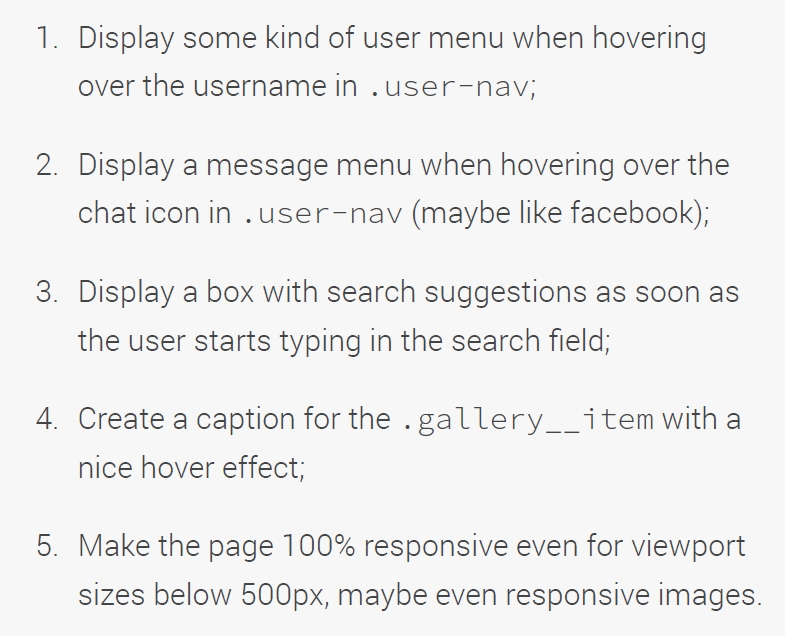
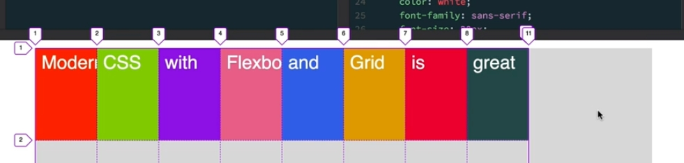
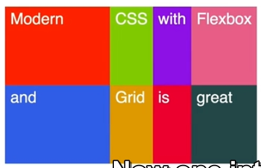
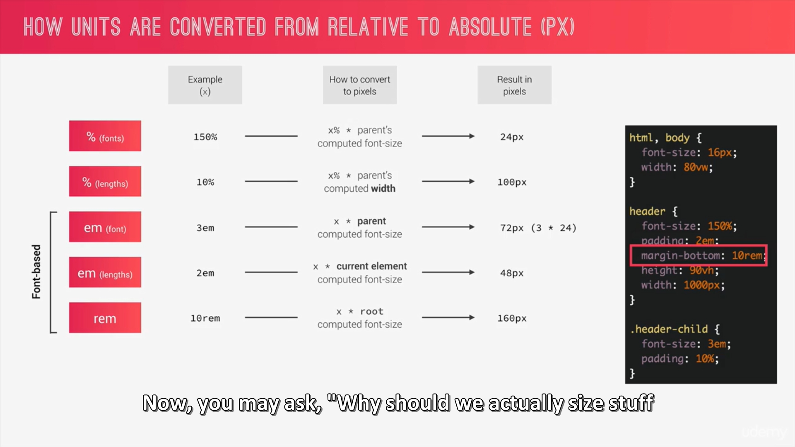
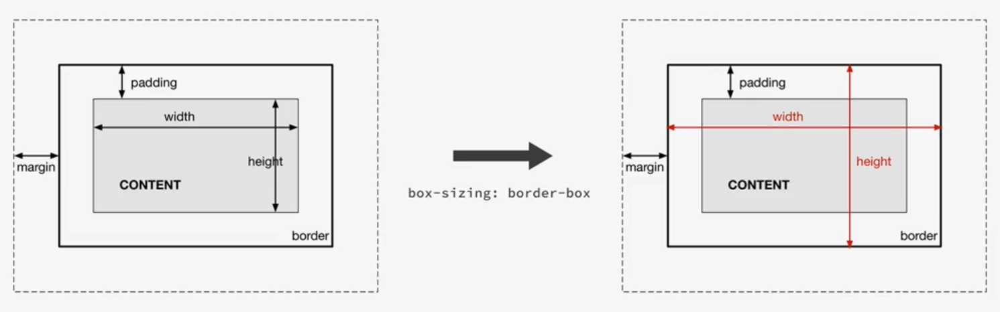

# Advanced CSS
Design and tutorials by [Jonas Schmedtmann)](https://codingheroes.io/)

**[Natours, Trillo & Nexter](https://nath-a.github.io/advanced-CSS)**
## Natours project (SASS 101)
[Natours](https://nath-a.github.io/advanced-CSS/01_Natours)

### Passe 1 - CSS
- [x] Header HTML + CSS
- [x] Header CSS better practices
- [X] Header implement BEM
### Passe 2 - HTML & SASS
- [x] Intro Section
- [x] About Section
- [x] Features Section
- [x] Tours Section
- [x] Stories Section
- [x] Booking Section
- [x] Footer
- [x] Navigation
- [x] Popup
### Passe 3 - Responsive
- [x] Responsive with media queries
- [ ] Responsive images HTML > need Photoshop - WIP
- [ ] Responsive images CSS > WIP
- [ ] Test if everything is working on old browsers

## Trillo Project (Flexbox 305)
[Trillo](https://nath-a.github.io/advanced-CSS/02_Trillo)
- [x] Overall layout
- [x] Header
- [x] Navigation
- [x] Hotel Overview
- [x] Description section
- [x] User reviews section
- [x] CTA Section
- [x] Media Queries 
- [ ] Challenge 
  

## Nexter Project (Grid 305)
[Nexter](https://nath-a.github.io/advanced-CSS/03_Nexter)
- [x] Overall layout
- [x] Features section
- [x] Story section
- [x] Homes section
- [x] Gallery
- [x] Footer
- [x] Sidebar
- [x] Header
- [x] Realtors section
- [x] Media Queries

### Notes
___

  
Visual Studio Code

  <ul>
    <li><b>CTRL + D</b> : Select terms to modify all at the same time</li>
    <li><b>MAJ + ALT + right arrow</b> : expand selection </li>
    <li><b>MAJ + ALT + left arrow</b> : shrink selection</li>
  </ul>

  
CSS good practices

  <ul>
  <li> Begin project with the usual *, *::before, *::after {} for padding and margin to zero **AND** add box-sizing:inherit; + body {box-sizing:border-box;}</li> 
  <li>Put font-family into the body and not into the * selector.</li>
  <li><b>Using REM instead of px for lenght units</b> to simplify responsive design > put <b>html {font-size:~~10px~~ 62.5%;}</b> ( % to not overwrite the browser parameters written by the user) to html selector</li>
  <li>When we have adecimal number, don't write the 0 > ~~0.5rem~~ > <b>.5</b>rem</li>
  <li></li>
  </ul>

  
CSS vocabulary

  <ul>
    <li>CSS Terminology : </li>
  </ul>

  
CSS animation

  <ul>
    <li>Don't use more than 2 properties in keyframes animation (opacity and transform)</li>
    <li><b>animation-iteration-count</b> : x; > repeat X time the animation</li>
    <li><b>all in one animation</b> : name, animation duration, animation timing function, animation delay;</li>
    <li></li>
  </ul>

  
CSS GRID

  <ul>
    <li><b>grid-auto-rows : 80px;</b> > for implicit stuff supposed to be display into grid but not explicitely defined with grid-template-rows and grid-template-columns</li>
    <li><b>grid-auto-flow : row/column dense;</b> > to place stuff not explicitely defined (row is default) dense is for no gap</li>
    <li>grid-template-columns/rows:<b>[...] max-content</b> [...]; > take only space needed by content, nothing more and without line-break </li> 
    <li>grid-template-columns/rows:<b>[...] min-content</b> [...]; > take only space needed by content, nothing more but with line-break </li> 
    <li>grid-template-columns/rows:[...] repeat(<b>auto-fill</b>, x px); > automatically creates as many tracks with the desired width we specify as fit into the container</li> 
    <li>grid-template-columns/rows:[...] repeat(<b>auto-fit</b>, x px); > automatically creates as many tracks with the desired width we specify as fit into the container but coolapse the empty-ones and leave an empty space into the container </li> 
    <li><b>grid-template-columns:repeat(auto-fit, minmax(200px,1fr);</b> > creates columns depending of the minmax function, put to the second row what doesn't fit </li>
    <li>grid-template-columns/rows:<b>[...] min-max(150px, min content...)</b> [...]; > at least 150px, at most min content</li>
    <li>A fractional unit fills up the entire remaining space but it is never smaller than the minimum content of a row or a column  </li>
    <li> grid-row: 1/<b>-1</b>; > the -1 is the last <b>explicit grid line</b></li>
  </ul>

  

  <ul>
    <li></li>
  </ul>

  
#### **New stuff learned right now (WHAT A MESS TO REFACTOR!)**
- **Multiple background** (image + gradient/color) : background-image:*gradient*,*image url* ; 
- **clip-path**:polygon (Top Left, Top Right, Bottom Right, Bottom Left); same effect than fusion mask on Photoshop each point takes X and Y coordonate

- **animation-timing-function** : linear, ease in ease on stuff
- **backface-visibility** : hidden > hack for unwanted animation shake comming from ... who knows ?🤷🏾‍♀️ . To put on the container of animated stuff 
- More than one transform > **transform : transform1() transform2();** no comma
- **.class:link** : link is a state of the button selector. Best practice to use **a:link** also
- 
- **animation-fill-mode** : backwards > Automaticaly apply the styles up to zero percent before the animation starts.
- **Units conversions**

- **Box model** : Fill area = content + padding + border (area that gets filled with background color or background image)
- **Box-sizing:border-box**

  Dimensions will be for the entire fill area, not just for the content area
- **Component-driven design**
  
- **BEM**
  
- **Architecture folders : 7-1 pattern**
  
  - base : basic product definitions [???]
  - utilities : classes with a unique and simple goal
  - components : one file for each component
  - layout : to define the overall layout of the project
  - pages : style for specific pages of the project
  - themes : if we use different visual themes
  - abstracts : no css, but variables, functions and mixins
  - vendors : where all third part CSS goes
- **Comments in SASS** //comment
- **Nesting**
- 

- **Mixin** : reusable piece of code > @mixin name {}
  
  
- **Placeholder and extend** : for elements who looks almost exactly alike 
  
- **Command line ls** are not working on windows. Instead use "dir"

- **Command to convert** : sass sass/input.scss css/output.css
- **Command to watch** : sass --watch input.scss output.css
- **Using Calc with variables** : Put the variable beetwin brackets with the # before > width:calc((100% - **#{** $gutter-horizontal **}**) / 2);
- **Select all of the elements in which the class attribute START with "col-"** > [class^="col-"]{}
- **Select all of the elements in which the class attribute END with "col-"** > [class$="col-"]{}
- **Select all of the elements in which the class attribute CONTAIN "col-"** > [class*="col-"]{} 
- **To add a gradient to a text** : 
  - background: linear-gradient(#eee, #333);
  - webkit-background-clip: text;
  - webkit-text-fill-color: transparent;
- **background-blend-mode** : to blend 2 images like with "mode" from Photoshop
- **box-decoration-break:clone;** : /! dont forget the -webkit- ! specifies how an element's fragments should be rendered when broken across multiple lines, columns, or pages.
  - **clone**  apply all the declarations that we have in the selector to all of the box created by an element. > One element, two boxes, both styled
  
- **Shape-outside: circle(50% at 50% 50%);0** : create a circle for text "habillage". Need to specify width, height, and be floating.
- **objct-fit : cover;** : like background-size. /! fill will fucked up the aspect ratio
- **adjacent siblings selector** : 
  - direct AFTER"+"
  - AFTER but not directly "~"
- **the "!important" usage** : only in the utilities classes
- **cubic-bezier** : [https://easings.net/](https://easings.net/) & [https://cubic-bezier.com/](https://cubic-bezier.com/)
- **background-size:100%; = contain, not cover !**
- [Sizzy](https://sizzy.co) > **To see our online website on different devices**
- **Density switching** : different images for different screen type : 
- *img srcset="src 1x, src 2x"* : allows the browser to choose the best of these images according to the screen used to display the webpage. 1x = low resolution screen | 2x = high resolution screen
- **Art direction** : different images for different viewport width
- *<picture></picture>* : allows to specify multiple sources for one image. Into the <source> element, we can write a media query. Apply like an "if". If the screen don't fit the media query, it uses what is specified into the 
- 
- **Resolution switching method** : 
- 
- **backdrop-filter** : apply a filter to content behind the element
- **@supports(property){}** : specify special design if the browser supports this property.
- To download SVG & sprite : [https://icomoon.io/](https://icomoon.io/)
- **flex:0 0 18%;** : flex grow (no grow if enough place), flex shrink (no shrink if not enough), flex basis (site to occupy)
- **To color a SVG file in css** > fill : color;
- color:<b>current color</b>; : to use same color as parent element
- <b>flex:1;</b> : occupy all space available 
- on flex childs : margin-right:auto; > for automatically calculated margin between elements
- 
- <b>Change the color of an image in CSS :</b> (-webkit-)mask-image : url(same as background-image); & (-webkit-)mask-size :cover